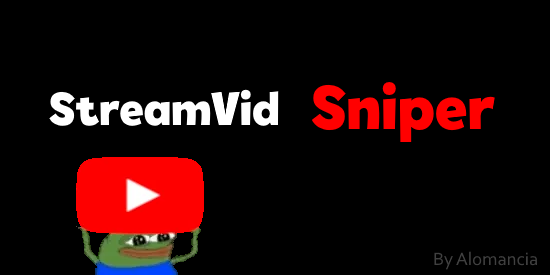

# StreamVidSniper




Get Youtube links from Twitch chat.

## Introduction

**StreamVid Sniper** is a desktop application built with Python and PyQt6 that connects to a live Twitch chat, detects YouTube links shared by users, and displays detailed information about the videos in a modern graphical interface.

## 🚀 Features

- 🟣 Real-time connection to a Twitch channel's live chat.
- 🔗 Automatic detection of YouTube links.
- 🎬 Displays video title, duration, thumbnail and publish date.
- 👤 Shows the username of the person who shared the video.
- ⏫ Newest videos appear at the top (reverse chronological order).
- 🖱️ Clickable video items that open in your default web browser.
- 📜 Separate tab for log/history.

## 📦 Installation

## Run from source

> [!IMPORTANT]
> You need a Twitch and Google API and change it in the .py file.
> (Probably gonna change it to make it more user friendly)

- Google: https://developers.google.com/youtube/v3?hl=es-419
- Twitch: https://dev.twitch.tv/console

1. Clone the repository:

```bash
git clone https://github.com/alomancia/StreamvidSniper.git
cd StreamVidSniper
```

2. Install the dependencies:
```
pip install -r requirements.txt
```
3. Run the application:
```
python StreamVidSniper_Public.py
```

## [WIP] Compiled Download

Work in progress.
